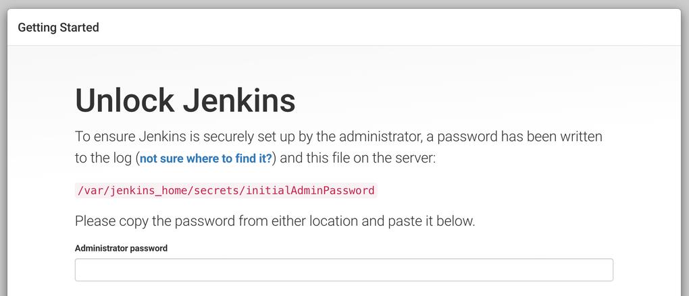

# 포팅 매뉴얼

## 목차

### 1. [사용 도구]

### 2. [개발 도구]

### 3. [개발 환경]

### 4. [환경변수 형태]

### 5. [CI/CD 구축]

### 6. [빌드 및 실행]

## 1. 사용 도구

---

- 이슈 관리 : Jira
- 형상 관리 : GitLab
- 커뮤니케이션 : Notion, MatterMost
- 디자인 : Figma
- CI/CD : Jenkins
- 모니터링 : Prometheus / Grafana

## 2. 개발 도구

---

- Android Studio : Android 14.0(”UpsideDownCake”)
- Intellij : 2023.3.2 (Ultimate Edition)

## 3. 개발 환경

---

## Frontend

| Dart | 3.2.6 |
| --- | --- |
| Flutter | 3.16.9 |

## Backend

| Java | openjdk version "17.0.9" 2023-10-17 LTS |
| --- | --- |
| Spirng boot | 3.2.2 |

## **Server**

| AWS EC2 | Ubuntu 20.04.6 LTS |
| --- | --- |
| AWS S3 |  |
| AWS RDS | mysql : 8.0.33 |

## **Service**

| Docker | 25.0.1 |
| --- | --- |
| Jenkins | 2.426.3 |
| Prometheus | 2.49.1 |
| Grafana | 10.3.1 |
| Redis | 7.2.4 |

## Ai

| Yolo | v8 |
| --- | --- |

## 4. 환경 변수

---

- **Backend**

application.properties

```jsx
spring.datasource.driver-class-name=com.mysql.cj.jdbc.Driver
spring.datasource.url="DB주소"
spring.datasource.username="유저id"
spring.datasource.password="비밀번호"
spring.jpa.show-sql=true
spring.jpa.hibernate.ddl-auto=none
spring.jpa.properties.hibernate.format_sql=true
spring.jpa.properties.hibernate.dialect=org.hibernate.dialect.MySQLDialect
spring.jpa.database-platform=org.hibernate.dialect.MySQLDialect
spring.jpa.properties.hibernate.default_batch_fetch_size=10

spring.thymeleaf.cache=false

spring.data.redis.host="redis Host 주소"
spring.data.redis.port="redis Port 주소"

cloud.aws.stack.auto=false
```

aws_s3.properties

```jsx
aws_s3_accessKey="s3 버킷 access key"
aws_s3_secretKey="s3 버킷 secret key"
aws_s3_secret_bucketName="s3 버킷 이름"
aws_s3_region_static=ap-northeast-2
```

- **Flutter**

pubspec.yaml

```jsx
name: kofoos
description: "KOFOOS"
publish_to: 'none' 

version: 1.0.0+1

environment:
  sdk: '>=3.2.4 <4.0.0'

dependencies:
  flutter:
    sdk: flutter
  cupertino_icons: ^1.0.2
  get: ^4.6.6
  fluttertoast: ^8.2.4
  carousel_slider: ^4.0.0
  change_app_package_name: ^1.1.0
  animation_list: ^2.2.1
  dio: ^4.0.0
  http: ^0.13.3
  device_info: ^2.0.3
  provider: ^6.0.1
  cached_network_image: ^3.2.0
  animations: ^2.0.0
  flutter_vision: ^1.1.4
  image_picker: ^1.0.7
  camera: ^0.10.5+9
  flutter_speed_dial: ^7.0.0
  image: ^4.1.6
  pytorch_lite: ^4.2.4
  simple_barcode_scanner:
    path: ../packages/simple_barcode_scanner-main/
  lazy_load_indexed_stack: ^1.1.0
  shake: ^2.2.0
  vibration: ^1.8.4
  motion_toast: ^2.8.0

dev_dependencies:
  flutter_test:
    sdk: flutter
  flutter_lints: ^2.0.0
dependency_overrides:
  sensors_plus: ^4.0.2
flutter:
  uses-material-design: true
  assets:
    - assets/icon/
    - assets/logo/
    - assets/info/
    - assets/editor/carousel/
    - assets/editor/content/
    - assets/editor/related_products/
    - assets/ranking/
    - assets/test/
    - assets/ai/

```

## 5. CI/CD 구축

---

- **aws ec2 - 젠킨스 설치**

```jsx
sudo apt-get update

sudo apt-get install -y\
    apt-transport-https \
    ca-certificates\
    curl\
    gnupg-agent\
    software-properties-common

curl -fsSL https://download.docker.com/linux/ubuntu/gpg | sudo apt-key add -

sudo add-apt-repository "deb [arch=amd64] https://download.docker.com/linux/ubuntu $(lsb_release -cs) stable"

sudo apt-get update
sudo apt-get install net-tools

sudo apt-get install -y docker-ce docker-ce-cli containerd.io docker-compose docker-compose-plugin

mkdir -p /var/jenkins_home
# 권한 설정
chown -R 1000:1000 /var/jenkins_home/
# 호스트 8888:컨테이너8080 매핑/ 포트50000을 도커 소켓 통신 위해 매핑
docker run --restart=on-failure --user='root' -p 8888:8080 -p 50000:50000 --env JAVA_HOME=/usr/lib/jvm/java-17-openjdk-amd64 -v /var/jenkins_home:/var/jenkins_home -v /var/run/docker.sock:/var/run/docker.sock -d --name jenkins jenkins/jenkins:lts
```

도메인:8888로 이동 후 → console에  cat /var/jenkins_home/secrets/initialAdminPassword 결과 입력  



플러그인 설치


[젠킨스.docx](./젠킨스.docx)

- **aws ec2 - 레디스 도커 설치**

```jsx
docker pull redis:latest
docker run --name redis -p 6379:6379 -it -d redis
```

- **플러터 apk**

앱 서명

1. android 폴더에서 key 생성

keytool -genkey -v -keystore key.jks -keyalg RSA -keysize 2048 -validity 10000 -alias key

1. android 폴더 내 keystore 디렉토리 생성 후 key 넣기
2. keystore에 keystore.password파일 만든 후 비밀번호 입력


1. .gitignore에  /keystore 추가
2. app - [proguard-rules.pro](http://proguard-rules.pro) 파일 생성
    
    ```jsx
    ## Flutter wrapper
    -keep class io.flutter.app.** { *; }
    -keep class io.flutter.plugin.**  { *; }
    -keep class io.flutter.util.**  { *; }
    -keep class io.flutter.view.**  { *; }
    -keep class io.flutter.**  { *; }
    -keep class org.pytorch.** { *; }
    -keep class io.flutter.plugins.**  { *; }
    -keep class com.facebook.** {*;}
    -dontwarn io.flutter.embedding.**
    ```
    
3. app - build.gradle에 추가

```jsx
signingConfigs {
        release {
            storeFile file('../keystore/key.jks')
            storePassword file('../keystore/keystore.password').text.trim()
            keyPassword file('../keystore/keystore.password').text.trim()
            keyAlias 'key'
        }
    }

    buildTypes {
        release {
            shrinkResources false   // 난독화 적용 시 true
            minifyEnabled false    //  난독화 적용 시 true
            proguardFiles getDefaultProguardFile('proguard-android.txt'), 'proguard-rules.pro'
            // TODO: Add your own signing config for the release build.
            // Signing with the debug keys for now, so `flutter run --release` works.
            signingConfig signingConfigs.release

        }
    }
```

1. apk 생성 ——— 경로 /build/app/outputs/apk/release/app-release.apk

```jsx
flutter build apk --release --target-platform=android-arm64
```

## 6.  빌드 및 실행

- 백엔드 실행 `/build/build/libs/`

```jsx
java -jar api-0.0.1-SNAPSHOT.jar
```

- 플러터 실행 - apk 파일 생성 후

```jsx
flutter install
```
